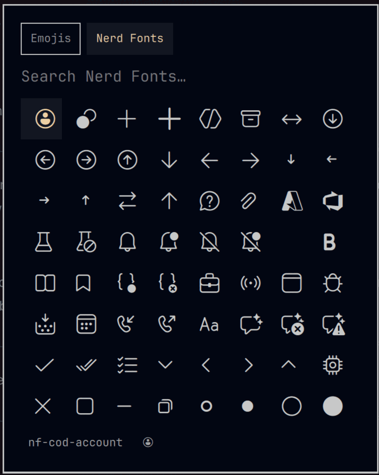

# Emojis & Nerd Fonts for Omarchy

An emoji **and** Nerd Font glyph picker for [Omarchy](https://omarchy.org) —
a drop-in replacement for the built-in emoji picker. SUPER+CTRL+E keeps
working; it just opens this picker instead.

> **Acknowledgment:** this plugin was heavily developed with AI assistance
> (GLM-5.3). All code has been reviewed and tested by the repository owner.



## Features

- **Two datasets, one popup** — 1,800+ emojis and 10,600+ Nerd Font glyphs
- **`!house` flips to Nerd Fonts instantly** — the leading `!` is a sticky
  mode switch; **Tab** or the header tabs switch back and forth
- **Multi-word search** — every word must match, so `md home` finds
  `nf-md-home`
- **Named glyphs** — in Nerd Fonts mode the footer shows the selected
  glyph's official name (`nf-md-home`), handy for configs and prompts
- **Type or copy** — Enter or left-click types the glyph into the focused
  app; Ctrl+Enter or right-click copies it to the clipboard (it stays
  pasteable and enters the clipboard history)
- **Full keyboard navigation** — arrows, PageUp/PageDown, Escape
- **Theme-aware** — follows your Omarchy theme, light or dark

## How it replaces the built-in picker

The manifest declares `"omarchy": { "clonedFrom": "omarchy.emojis" }`. When
enabled, the Omarchy shell routes every `omarchy.emojis` call — the
SUPER+CTRL+E binding and `omarchy menu emoji` — to this plugin and disables
the built-in picker. Disabling or removing the plugin restores the built-in
picker automatically. No user configuration is overwritten.

## Typing vs. copying

The default actions deliberately keep the original `omarchy.emojis` picker's
behavior, for as much compatibility as possible:

- **Enter / left-click types** the glyph, exactly like the built-in picker:
  an ephemeral, paste-only clipboard grab plus a paste keystroke inserts it
  into the focused app and **leaves no copy in your clipboard or its
  history**.
- **Ctrl+Enter / right-click copies** the glyph for the cases where you do
  want a copy: a regular `wl-copy` that keeps the glyph on the clipboard —
  pasteable anywhere, repeatedly, and visible in the clipboard manager.

## Requirements

- [Omarchy](https://omarchy.org) with shell plugin support
- Everything else already ships with Omarchy: wl-clipboard, wtype, and a
  Nerd Font

> **Rendering note:** emojis render in any app. Nerd Font glyphs render
> correctly in apps that use a Nerd Font — Omarchy's terminal and bar fonts
> do. Apps without one substitute a different character for those
> codepoints.

## Install

```bash
omarchy plugin add https://github.com/farangkao/omarchy-emojis-nerd.git --enable
```

SUPER+CTRL+E now opens this picker.

### Update

```bash
omarchy plugin update farangkao.emojis-nerd
```

### Remove

```bash
omarchy plugin remove farangkao.emojis-nerd
```

Removal re-enables the built-in emoji picker.

## Controls

| Input | Action |
| --- | --- |
| Type text | Search the active dataset |
| `!` + text | Switch to Nerd Fonts and search (`!house`) |
| Tab | Toggle emojis ↔ Nerd Fonts (the filter is kept) |
| Header tabs | Switch modes with the mouse |
| Arrow keys / PageUp / PageDown | Move the cursor |
| Enter | Type the selected glyph into the focused app |
| Ctrl+Enter | Copy the selected glyph to the clipboard |
| Left click | Type the glyph |
| Right click | Copy the glyph |
| Escape | Clear the filter, then close |

## Development

Tasks live in [`mise.toml`](mise.toml) ([mise](https://mise.jdx.dev)):

```bash
mise run test               # search-logic + dataset tests
mise run validate           # omarchy plugin validate
mise run install-local      # sync into ~/.config/omarchy/plugins + restart shell
mise run check-dataset      # check for a new Nerd Fonts release, preview glyph changes
mise run regenerate-dataset # rebuild nerdfonts.tsv from the pinned Nerd Fonts release
mise run submission-body    # preview the marketplace submission issue
mise run publish            # submit to the Omarchy plugin marketplace
```

Without mise everything is a plain file: run `tests/*.sh` directly,
`omarchy plugin validate .`, and `python3 tools/convert_nerd.py --help`.

Local dev loop: edit → `mise run install-local` → SUPER+CTRL+E.

### Dataset

`nerdfonts.tsv` is generated from Nerd Fonts `glyphnames.json` (name →
codepoint mapping only; no font data), pinned to v3.5.0. One line per
glyph: keywords, name, hex codepoint. Alias names sharing a codepoint are
merged, and keywords are source-derived only — the name in its `nf-`, raw,
and dashed forms plus its words. Set labels ("material", "fontawesome",
…) are deliberately left out so they don't match thousands of glyphs at
once; narrow by prefix instead (`md home`).

Nerd Font search streams the file through `grep` instead of loading it
into memory: only the visible page of results is ever resident, and a
regenerated dataset applies on the next search with no shell restart.
Emojis (108 KB) stay in memory for instant as-you-type filtering.

## License

[MIT](LICENSE) — with notices for Omarchy and Nerd Fonts in
[THIRD_PARTY_NOTICES.md](THIRD_PARTY_NOTICES.md).
